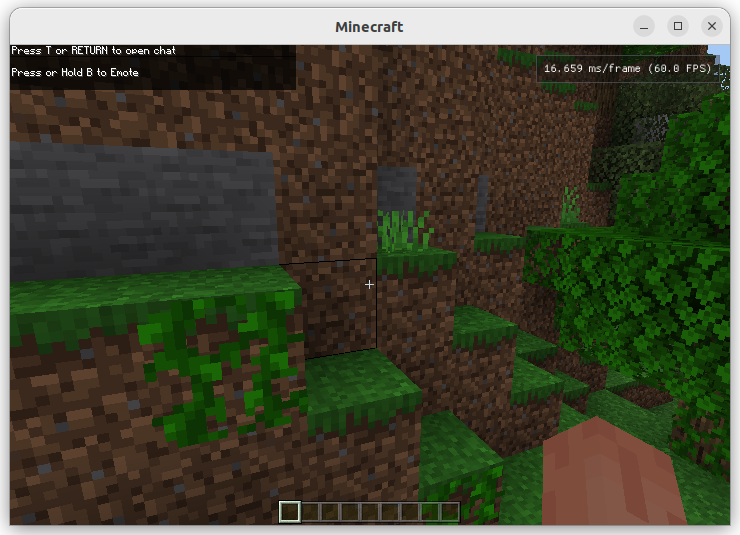

# mcpelauncher-imgui-fps-hud

This is a mod for mcpelauncher-manifest to display a fps counter.

## Building
`PATH_TO_NDK="/path/to/ndk"`
- x86

  `cmake -DCMAKE_TOOLCHAIN_FILE=$PATH_TO_NDK/build/cmake/android.toolchain.cmake -DANDROID_ABI=x86 ..`
- x86_64

  `cmake -DCMAKE_TOOLCHAIN_FILE=$PATH_TO_NDK/build/cmake/android.toolchain.cmake -DANDROID_ABI=x86_64 ..`
- armeabi-v7a

  `cmake -DCMAKE_TOOLCHAIN_FILE=$PATH_TO_NDK/build/cmake/android.toolchain.cmake -DANDROID_ABI=armeabi-v7a ..`
- arm64-v8a

  `cmake -DCMAKE_TOOLCHAIN_FILE=$PATH_TO_NDK/build/cmake/android.toolchain.cmake -DANDROID_ABI=arm64-v8a ..`

## Requirements
- either mcpelauncher v0.13.0 and newer on macOS or usage of `mcpelauncher-client` flag `-fes`
- on linux it should be backward compatible to v0.3.0
